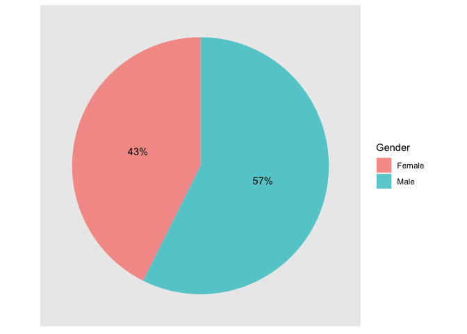

Exploratory Data Analysis
================
Peter Chong

``` r
library(knitr)
library(dplyr)
library(ggplot2)
```

``` r
#Input files
df <- read.csv("/Users/wengliangchong/Desktop/RunTheData/MarathonData.csv", header = T, 
               stringsAsFactors = FALSE)
```

``` r
numOfRunners <- c()
maleRunnersPerc <- c()
mostAge <- c()

numOfRunners[5] <- nrow(df)
maleRunnersPerc[5] <- length(which(df$Gender == "Male")) / nrow(df)
mostAge[5] <- tail(names(sort(table(df$Age))),1)

for (i in 1:4) {
  year <- paste0("201", i+4)
  numOfRunners[i] <- length(which(df$Year == year))
  maleRunnersPerc[i] <- length(which(df$Gender == "Male" & df$Year == year)) / numOfRunners[i]
  mostAge[i] <- tail(names(sort(table(df[which(df$Year == year),]$Age))),1)
}

maleRunnersPerc <- sapply(sapply(maleRunnersPerc, prod, 100), round, digits = 2)
info <- list("#Runners" = numOfRunners, "Male%" = paste(maleRunnersPerc, "%", ""), 
          "Most Frequent Age" = mostAge)
info <- data.frame(matrix(unlist(info), nrow=length(info), byrow=T))
colnames(info) <- c("2015", "2016", "2017", "2018", "Total")
rownames(info) <- c("#Runners", "Male%", "Most Frequent Age")
kable(info)
```

|                   | 2015    | 2016    | 2017    | 2018   | Total   |
| ----------------- | :------ | :------ | :------ | :----- | :------ |
| \#Runners         | 20283   | 18615   | 17919   | 18843  | 75660   |
| Male%             | 58.07 % | 55.73 % | 57.99 % | 57.7 % | 57.38 % |
| Most Frequent Age | 17      | 17      | 17      | 17     | 17      |

``` r
ggplot(df, aes(Age)) + 
  geom_bar(aes(fill = as.character(Year))) + 
  ggtitle("Participants per age group by year") + 
  guides(fill=guide_legend(title="Year")) + 
  xlim(c(12, 80)) + 
  theme(legend.position = c(0.85, 0.7))
```

<!-- -->

``` r
ggplot(df, aes(x=Gender,y=Age,fill=Gender)) +
  geom_boxplot(show.legend = F) + 
  ggtitle("Boxplot of Ages based on Gender")
```

<!-- -->
