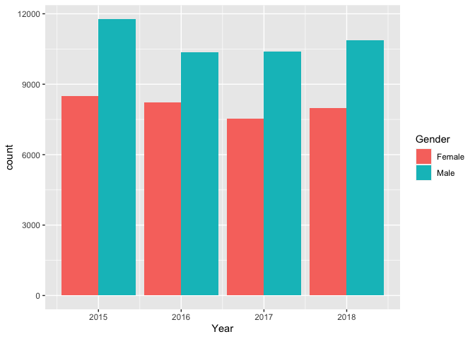
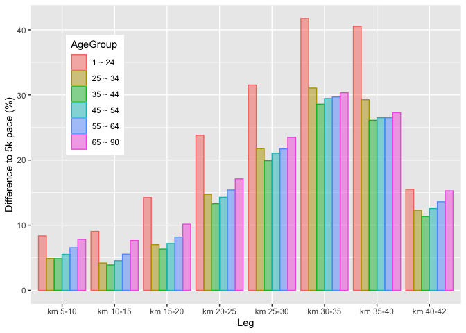

Exploratory Data Analysis
================
Peter Chong

``` r
library(knitr)
library(dplyr)
library(ggplot2)
library(ggridges)
library(lubridate)
library(scales)
```

``` r
#Input files
df <- read.csv("/Users/wengliangchong/Desktop/RunTheData/MarathonData.csv", header = T, stringsAsFactors = F)
```

We have a dataset of 75660 runners information across 4 years
(2015~2018). Let’s look at the head of data.

``` r
head(df)
```

    ##               Name   Bib Age Gender Year Position Gender.Position
    ## 1  VIDAL GUTIERREZ 30529  15   Male 2015      784             661
    ## 2    JUAN TRUJILLO 31951  15   Male 2015      946             795
    ## 3 CHRISTIAN GUERRA 30526  15   Male 2015     1092             914
    ## 4    ANGEL ZAZUETA 32498  14   Male 2015     1110             929
    ## 5  JEFFREY PERALES 32478  13   Male 2015     1160             972
    ## 6      NOEL ORTEGA 32477  14   Male 2015     1161             973
    ##   Division.Position   X5k  X10k    X15k    X20k    X25k    X30k    X35k    X40k
    ## 1                 1 23:22 48:23 1:12:10 1:35:13 1:59:18 2:24:05 2:52:46 3:23:21
    ## 2                 2 25:14 50:22 1:14:33 1:38:16 2:02:32 2:27:47 2:55:24 3:24:19
    ## 3                 3 26:08 51:17 1:16:15 1:41:42 2:06:29 2:32:14 3:00:36 3:28:30
    ## 4                 4 28:17 54:29 1:19:30 1:44:00 2:10:14 2:36:49 3:04:04 3:29:33
    ## 5                 5 24:18 48:56 1:13:59 1:40:27 2:08:46 2:37:12 3:06:15 3:31:14
    ## 6                 6 24:18 48:57 1:14:00 1:40:27 2:08:46 2:37:13 3:06:21 3:31:14
    ##   Clock.Time Net.Time        Hometown
    ## 1    3:47:03  3:32:00 LOS ANGELES, CA
    ## 2    3:51:03  3:36:05  SOUTH GATE, CA
    ## 3    3:43:59  3:39:18 LOS ANGELES, CA
    ## 4    3:48:54  3:39:35 LOS ANGELES, CA
    ## 5    3:44:45  3:40:42    VAN NUYS, CA
    ## 6    3:44:45  3:40:42    VAN NUYS, CA

Let’s know the runners a little
better

### Finish time distribution by gender

``` r
ggplot(df, aes(x=as.POSIXct(Net.Time,format="%H:%M:%S"), fill = Gender, color=Gender)) + 
  geom_histogram(aes(y=..density..),alpha=0.1, position="identity", binwidth = 250) +
  geom_density(alpha=0.6, fill=NA) + xlab("Net Finish Time") + ylab("") +
  theme(legend.position = c(0.9, 0.8), axis.text.y = element_blank(), axis.ticks = element_blank())
```

<!-- -->

``` r
ggplot(df, aes(x=Age, fill=Gender, color=Gender)) +
  geom_histogram(aes(y=..density..),alpha=0.1, position = "identity", binwidth = 1) +
  geom_density(alpha=0.6, fill=NA) + ylab("Distribution") +
  theme(legend.position = c(0.9, 0.8)) + scale_x_continuous(breaks=round(seq(0, 90, by = 10),1))
```

<!-- -->

``` r
ggplot(df, mapping = aes(x = Age, y = as.POSIXct(Net.Time,format="%H:%M:%S"))) +
  stat_density_2d(aes(fill = ..level..), geom = "polygon") + ylab("Net Finish Time") +
  scale_fill_continuous(low="lightblue", high="darkblue") + 
  scale_x_continuous(breaks=round(seq(10, 70, by = 10),1)) + theme(legend.position = "none")
```

<!-- -->

``` r
df$AgeGroup <- ifelse(df$Age < 25 , "1 ~ 24", ifelse(df$Age < 35 , "25 ~ 34", ifelse(df$Age < 45 , "35 ~ 44",
                  ifelse(df$Age < 55 , "45 ~ 54", ifelse(df$Age < 65 , "55 ~ 64", "65 ~ 90")))))
```

``` r
ggplot(df, aes(x = as.POSIXct(Net.Time,format="%H:%M:%S"), y = AgeGroup, fill=stat(y))) + 
  geom_density_ridges(stat="binline", binwidth = 100, scale=1.5, alpha=0.3) + scale_fill_viridis_c(option = "C")+
  theme(legend.position = "none") + ylab("Age Group") + xlab("Net Finish Time")
```

<!-- -->

``` r
colors <- c(rep("lightgreen",21), rep("lightblue",20))
ggplot(df, aes(x=as.POSIXct(Net.Time,format="%H:%M:%S"))) + 
  geom_histogram(binwidth = 15, color="black", fill=colors) + xlab("Net Finish Time") + 
  xlim(c(as.POSIXct("03:55:00",format="%H:%M:%S"), as.POSIXct("04:05:00",format="%H:%M:%S")))
```

<!-- -->

``` r
sub4 <- nrow(df[which(as.POSIXct(df$Net.Time,format="%H:%M:%S") > as.POSIXct("03:55:00",format="%H:%M:%S") 
                      & as.POSIXct(df$Net.Time,format="%H:%M:%S") <= as.POSIXct("04:00:00",format="%H:%M:%S")),])
notsub4 <- nrow(df[which(as.POSIXct(df$Net.Time,format="%H:%M:%S") > as.POSIXct("04:00:00",format="%H:%M:%S") 
                         & as.POSIXct(df$Net.Time,format="%H:%M:%S") <= as.POSIXct("04:05:00",format="%H:%M:%S")),])
round(sub4/(sub4+notsub4)*100,1)
```

    ## [1] 55.1

``` r
time_to_sec <- function(string) {
  time_segments = strsplit(string, split = ":")[[1]]
  if (length(time_segments) == 2) {
    mins = as.numeric(time_segments[1])
    sec = as.numeric(time_segments[2])
    time = mins*60 + sec
  } else {
    hours = as.numeric(time_segments[1])
    mins = as.numeric(time_segments[2])
    sec = as.numeric(time_segments[3])
    time = hours*3600 + mins*60 + sec
  }
  return(time)
}
```

``` r
first5k <- c()
second5k <- c()
third5k <- c()
fourth5k <- c()
fifth5k <- c()
sixth5k <- c()
seventh5k <- c()
eighth5k <- c()
last2k <- c()
for (i in 1:nrow(df)) {
  first5k[i] <- time_to_sec(df$X5k[i])/5
  second5k[i] <- (time_to_sec(df$X10k[i]) - time_to_sec(df$X5k[i]))/5
  third5k[i] <- (time_to_sec(df$X15k[i]) - time_to_sec(df$X10k[i]))/5
  fourth5k[i] <- (time_to_sec(df$X20k[i]) - time_to_sec(df$X15k[i]))/5
  fifth5k[i] <- (time_to_sec(df$X25k[i]) - time_to_sec(df$X20k[i]))/5
  sixth5k[i] <- (time_to_sec(df$X30k[i]) - time_to_sec(df$X25k[i]))/5
  seventh5k[i] <- (time_to_sec(df$X35k[i]) - time_to_sec(df$X30k[i]))/5
  eighth5k[i] <- (time_to_sec(df$X40k[i]) - time_to_sec(df$X35k[i]))/5
  last2k[i] <- (time_to_sec(df$Net.Time[i]) - time_to_sec(df$X40k[i]))/2.195
  speed <- c(first5k[i], second5k[i], third5k[i], fourth5k[i],
             fifth5k[i], sixth5k[i], seventh5k[i], eighth5k[i], last2k[i])
  df$mean[i] <- mean(speed)
  df$sd[i] <- sd(speed)
}
```

``` r
ggplot(df, aes(Age, as.POSIXct(Net.Time,format="%H:%M:%S"))) +
  geom_point(aes(color = sd), alpha=0.7) + scale_color_gradient(low="#FDFBBB", high="#000000") +
  theme(legend.position = "none") + ylab("Net Finish Time") + scale_x_continuous(breaks=seq(5,90,10))
```

<!-- -->

``` r
d5k <- c()
d10k <- c()
d15k <- c()
d20k <- c()
d25k <- c()
d30k <- c()
d35k <- c()
d40k <- c()
d42k <- c()
for (i in 1:nrow(df)) {
  d5k[i] <- (first5k[i] - df$mean[i])/df$mean[i]*100
  d10k[i] <- (second5k[i] - df$mean[i])/df$mean[i]*100
  d15k[i] <- (third5k[i] - df$mean[i])/df$mean[i]*100
  d20k[i] <- (fourth5k[i] - df$mean[i])/df$mean[i]*100
  d25k[i] <- (fifth5k[i] - df$mean[i])/df$mean[i]*100
  d30k[i] <- (sixth5k[i] - df$mean[i])/df$mean[i]*100
  d35k[i] <- (seventh5k[i] - df$mean[i])/df$mean[i]*100
  d40k[i] <- (eighth5k[i] - df$mean[i])/df$mean[i]*100
  d42k[i] <- (last2k[i] - df$mean[i])/df$mean[i]*100
}
```

``` r
Checkpoint <- c("5 km", "10 km", "15 km", "20 km", "25 km", "30 km", "35 km", "40 km", "42 km")
Gender <- rep(c("Male", "Female"),each=9)
Diff <- c()
lengthj <- c(1,10)
for (j in lengthj) {
  Diff[j] <- mean(d5k[which(df$Gender == Gender[j])])
  Diff[j+1] <- mean(d10k[which(df$Gender == Gender[j+1])])
  Diff[j+2] <- mean(d15k[which(df$Gender == Gender[j+2])])
  Diff[j+3] <- mean(d20k[which(df$Gender == Gender[j+3])])
  Diff[j+4] <- mean(d25k[which(df$Gender == Gender[j+4])])
  Diff[j+5] <- mean(d30k[which(df$Gender == Gender[j+5])])
  Diff[j+6] <- mean(d35k[which(df$Gender == Gender[j+6])])
  Diff[j+7] <- mean(d40k[which(df$Gender == Gender[j+7])])
  Diff[j+8] <- mean(d42k[which(df$Gender == Gender[j+8])])
}
x <- data.frame("Checkpoint" = rep(Checkpoint,2), "Diff" = Diff, "Gender" = Gender)
```

``` r
ggplot(data=x, aes(x=Checkpoint, y=Diff, fill = Gender, color=Gender)) +
  geom_bar(stat="identity",position=position_dodge(), alpha=0.5) + 
  scale_x_discrete(limits=Checkpoint) + theme(legend.position = c(0.15, 0.8)) +
  ylab("Difference to average pace (%)") + scale_y_continuous(breaks=seq(-15,15,5))
```

<!-- -->

``` r
d5to10k <- c()
d10to15k <- c()
d15to20k <- c()
d20to25k <- c()
d25to30k <- c()
d30to35k <- c()
d35to40k <- c()
d40to42k <- c()
for (i in 1:nrow(df)) {
  d5to10k[i] <- (second5k[i] - first5k[i])/first5k[i]*100
  d10to15k[i] <- (third5k[i] - first5k[i])/first5k[i]*100
  d15to20k[i] <- (fourth5k[i] - first5k[i])/first5k[i]*100
  d20to25k[i] <- (fifth5k[i] - first5k[i])/first5k[i]*100
  d25to30k[i] <- (sixth5k[i] - first5k[i])/first5k[i]*100
  d30to35k[i] <- (seventh5k[i] - first5k[i])/first5k[i]*100
  d35to40k[i] <- (eighth5k[i] - first5k[i])/first5k[i]*100
  d40to42k[i] <- (last2k[i] - first5k[i])/first5k[i]*100
}
```

``` r
Leg <- c("km 5-10", "km 10-15", "km 15-20", "km 20-25", "km 25-30", "km 30-35", "km 35-40", "km 40-42")
Gender <- rep(c("Male", "Female"),each=8)
Diff <- c()
lengthj <- c(1,9)
for (j in lengthj) {
  Diff[j] <- mean(d5to10k[which(df$Gender == Gender[j])])
  Diff[j+1] <- mean(d10to15k[which(df$Gender == Gender[j+1])])
  Diff[j+2] <- mean(d15to20k[which(df$Gender == Gender[j+2])])
  Diff[j+3] <- mean(d20to25k[which(df$Gender == Gender[j+3])])
  Diff[j+4] <- mean(d25to30k[which(df$Gender == Gender[j+4])])
  Diff[j+5] <- mean(d30to35k[which(df$Gender == Gender[j+5])])
  Diff[j+6] <- mean(d35to40k[which(df$Gender == Gender[j+6])])
  Diff[j+7] <- mean(d40to42k[which(df$Gender == Gender[j+7])])
}
x1 <- data.frame("Leg" = rep(Leg,2), "Diff" = Diff, "Gender" = Gender)
```

``` r
ggplot(data=x1, aes(x=Leg, y=Diff, fill=Gender, color=Gender)) + ylab("Difference to 5k pace (%)") +
  geom_bar(stat="identity",position=position_dodge(), alpha=0.5) + theme(legend.position = c(0.15, 0.8)) +
  scale_x_discrete(limits=Leg)
```

<!-- -->

``` r
AgeGroup <- rep(c("1 ~ 24", "25 ~ 34", "35 ~ 44", "45 ~ 54", "55 ~ 64", "65 ~ 90"), each=8)
Diff <- c()
lengthj <- c(1,9,17,25,33,41)
for (j in lengthj) {
  Diff[j] <- mean(d5to10k[which(df$AgeGroup == AgeGroup[j])])
  Diff[j+1] <- mean(d10to15k[which(df$AgeGroup == AgeGroup[j+1])])
  Diff[j+2] <- mean(d15to20k[which(df$AgeGroup == AgeGroup[j+2])])
  Diff[j+3] <- mean(d20to25k[which(df$AgeGroup == AgeGroup[j+3])])
  Diff[j+4] <- mean(d25to30k[which(df$AgeGroup == AgeGroup[j+4])])
  Diff[j+5] <- mean(d30to35k[which(df$AgeGroup == AgeGroup[j+5])])
  Diff[j+6] <- mean(d35to40k[which(df$AgeGroup == AgeGroup[j+6])])
  Diff[j+7] <- mean(d40to42k[which(df$AgeGroup == AgeGroup[j+7])])
}
x2 <- data.frame("Leg" = rep(Leg,6),
                "Diff" = Diff, "AgeGroup" = AgeGroup)
```

``` r
ggplot(data=x2, aes(x=Leg, y=Diff, fill=AgeGroup, color=AgeGroup)) + ylab("Difference to 5k pace (%)") +
  geom_bar(stat="identity",position=position_dodge(), alpha=0.5) + theme(legend.position = c(0.15, 0.7)) +
  scale_x_discrete(limits=Leg)
```

<!-- -->
