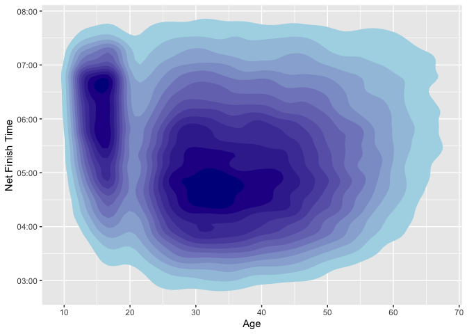

Exploratory Data Analysis
================
Peter Chong

``` r
library(ggplot2)
library(dplyr)
library(ggridges)
```

``` r
#Input files
df <- read.csv("/Users/wengliangchong/Desktop/RunTheData/MarathonData.csv", header = T, stringsAsFactors = F)
```

# The Dataset

We have a dataset of 75652 runners information across 4 years
(2015~2018). Let’s look at the head of data.

``` r
head(df)
```

    ##               Name   Bib Age Gender Year Position Gender.Position
    ## 1  VIDAL GUTIERREZ 30529  15   Male 2015      784             661
    ## 2    JUAN TRUJILLO 31951  15   Male 2015      946             795
    ## 3 CHRISTIAN GUERRA 30526  15   Male 2015     1092             914
    ## 4    ANGEL ZAZUETA 32498  14   Male 2015     1110             929
    ## 5  JEFFREY PERALES 32478  13   Male 2015     1160             972
    ## 6      NOEL ORTEGA 32477  14   Male 2015     1161             973
    ##   Division.Position   X5k  X10k    X15k    X20k    X25k    X30k    X35k    X40k
    ## 1                 1 23:22 48:23 1:12:10 1:35:13 1:59:18 2:24:05 2:52:46 3:23:21
    ## 2                 2 25:14 50:22 1:14:33 1:38:16 2:02:32 2:27:47 2:55:24 3:24:19
    ## 3                 3 26:08 51:17 1:16:15 1:41:42 2:06:29 2:32:14 3:00:36 3:28:30
    ## 4                 4 28:17 54:29 1:19:30 1:44:00 2:10:14 2:36:49 3:04:04 3:29:33
    ## 5                 5 24:18 48:56 1:13:59 1:40:27 2:08:46 2:37:12 3:06:15 3:31:14
    ## 6                 6 24:18 48:57 1:14:00 1:40:27 2:08:46 2:37:13 3:06:21 3:31:14
    ##   Clock.Time Net.Time        Hometown Temp AgeGroup X5ks X10ks X15ks X20ks
    ## 1    3:47:03  3:32:00 LOS ANGELES, CA   23   1 ~ 24 1402  2903  4330  5713
    ## 2    3:51:03  3:36:05  SOUTH GATE, CA   23   1 ~ 24 1514  3022  4473  5896
    ## 3    3:43:59  3:39:18 LOS ANGELES, CA   23   1 ~ 24 1568  3077  4575  6102
    ## 4    3:48:54  3:39:35 LOS ANGELES, CA   23   1 ~ 24 1697  3269  4770  6240
    ## 5    3:44:45  3:40:42    VAN NUYS, CA   23   1 ~ 24 1458  2936  4439  6027
    ## 6    3:44:45  3:40:42    VAN NUYS, CA   23   1 ~ 24 1458  2937  4440  6027
    ##   X25ks X30ks X35ks X40ks X42ks   Hubris15  Hubris20   Hubris25   Hubris30
    ## 1  7158  8645 10366 12201 12720 -4.9300466 -7.861426 -3.7308461 -0.9327115
    ## 2  7352  8867 10524 12259 12965 -3.7798408 -5.636605 -3.4482759  0.4641910
    ## 3  7589  9134 10836 12510 13158 -0.7289596  1.192843 -1.4579192  2.3856859
    ## 4  7814  9409 11044 12573 13175 -4.5165394 -6.488550  0.1272265  1.4631043
    ## 5  7726  9432 11175 12674 13242  1.6914750  7.442490 14.9526387 15.4262517
    ## 6  7726  9433 11181 12674 13242  1.6227181  7.302231 14.8749155 15.4158215
    ##    Hubris35   Hubris40   Hubris42 Humid first5kpace second5kpace third5kpace
    ## 1 14.656895 22.2518321 -21.237019    31       280.4        300.2       285.4
    ## 2  9.880637 15.0530504   6.644593    31       302.8        301.6       290.2
    ## 3 12.789927 10.9343936  -2.181444    31       313.6        301.8       299.6
    ## 4  4.007634 -2.7353690 -12.767277    31       339.4        314.4       300.2
    ## 5 17.929635  1.4208390 -12.459428    31       291.6        295.6       300.6
    ## 6 18.187965  0.9465855 -12.518617    31       291.6        295.8       300.6
    ##   fourth5kpace fifth5kpace sixth5kpace seventh5kpace eighth5kpace last2kpace
    ## 1        276.6       289.0       297.4         344.2        367.0   236.4465
    ## 2        284.6       291.2       303.0         331.4        347.0   321.6401
    ## 3        305.4       297.4       309.0         340.4        334.8   295.2164
    ## 4        294.0       314.8       319.0         327.0        305.8   274.2597
    ## 5        317.6       339.8       341.2         348.6        299.8   258.7699
    ## 6        317.4       339.8       341.4         349.6        298.6   258.7699

Let’s know the runners a little better

### Proportion of Gender

``` r
df1 <- df %>%
  group_by(Gender) %>%
  count() %>%
  ungroup() %>%
  mutate(per=`n`/sum(`n`)) %>% 
  arrange(desc(Gender))
df1$label <- scales::percent(df1$per)
ggplot(data=df1) + 
  geom_bar(aes(x="", y=per, fill=Gender), stat="identity", width = 1, alpha=0.7) +
  coord_polar("y", start=0) +
  geom_text(aes(x=1, y = cumsum(per) - per/2, label=label)) + 
  theme(axis.title.x = element_blank(), axis.title.y = element_blank(),
        panel.grid = element_blank(), axis.text.x = element_blank(),
        axis.ticks = element_blank(), panel.border = element_blank(), axis.text.y = element_blank())
```

<!-- -->

This graph is very simple, it show us that male has a higher proportion
across four years. Let’s see if that is the same case for each year.

### Proportion of Gender according to year

``` r
df2 <- df %>%
  group_by(Year, Gender) %>%
  count() %>%
  mutate(count=n) %>%
  ungroup()
ggplot(df2, aes(x=Year, y=count, fill=Gender)) + 
  geom_bar(stat="identity", position=position_dodge())
```

<!-- -->

Yes, it is. Male participants are higher than female participants every
year. Let’s see if male participants finish the marathon faster than
female
participants.

### Finish time distribution by gender

``` r
ggplot(df, aes(x=as.POSIXct(Net.Time,format="%H:%M:%S"), fill = Gender, color=Gender)) + 
  geom_histogram(aes(y=..density..),alpha=0.1, position="identity", binwidth = 250) +
  geom_density(alpha=0.6, fill=NA) + xlab("Net Finish Time") + ylab("") +
  theme(legend.position = c(0.9, 0.8), axis.text.y = element_blank(), axis.ticks = element_blank())
```

<!-- -->

Yes, male participants generally finish faster than female participants.
Interestingly, the finish time follows a normal distribution for both
men and women. Next, let’s see the age distribution across the four
years.

### Age Distribution

``` r
ggplot(df, aes(x=Age, fill=Gender, color=Gender)) +
  geom_histogram(aes(y=..density..),alpha=0.1, position = "identity", binwidth = 1) +
  geom_density(alpha=0.6, fill=NA) + ylab("Distribution") +
  theme(legend.position = c(0.9, 0.8)) + scale_x_continuous(breaks=round(seq(0, 90, by = 10),1))
```

<!-- -->

We can observe that there is a high interest in marathon for the people
ages 15~18 but significantly reduced for the people ages 19~25.  
This age distribution is very interesting as neither men or women curves
belong to a normal distribution. Although I do not know the reason
behind the spike in interest for the people ages 15~18, I would assume
people ages 19~25 are busy with university. Let’s see if this is the
same across four years.

### Age Distribution by Year

``` r
df$Year <- as.character(df$Year)
ggplot(df, aes(x = Age, y = Year, fill=stat(y))) + 
  geom_density_ridges(stat="binline", binwidth = 1, scale=1.5, alpha=0.3) +
  scale_fill_viridis_c(option = "C") + theme(legend.position = "none")
```

<!-- -->

``` r
df$Year <- as.numeric(df$Year)
```

Yes, it is true that the age distribution is very similar across all
four years. Unfortunately, I have no idea the reason behind this trend.
Next, we map the finish time to the Age
distribution.

### Net Finish Time against Age

``` r
ggplot(df, mapping = aes(x = Age, y = as.POSIXct(Net.Time,format="%H:%M:%S"))) +
  stat_density_2d(aes(fill = ..level..), geom = "polygon") + ylab("Net Finish Time") +
  scale_fill_continuous(low="lightblue", high="darkblue") + 
  scale_x_continuous(breaks=round(seq(10, 70, by = 10),1)) + theme(legend.position = "none")
```

<!-- -->

There are two different “typical runner” scenarios when we’re looking at
the finish times verses age. The early 30s that run in under 5 hours and
the teenagers that runs in under 7 hours.

Let’s plot age versus net finish times in a different way to see if we
can learn something
new.

### Ridge plot: Age Group against Finish Time

``` r
ggplot(df, aes(x = as.POSIXct(Net.Time,format="%H:%M:%S"), y = AgeGroup, fill=stat(y))) + 
  geom_density_ridges(stat="binline", binwidth = 100, scale=1.5, alpha=0.3) +
  scale_fill_viridis_c(option = "C") + theme(legend.position = "none") + 
  ylab("Age Group") + xlab("Net Finish Time")
```

<!-- -->

We notice that for age group below 24 and above 65, we can see a shift
in finish times to the right.  
We can also observe that the mean finish time excluding the age group 1
~ 24 and 65 ~ 90 is around 5 hours. One thing that I would like to look
into is the psychology around the five hour mark.

Let’s look closer at the finish times around 5 hours.

### Histogram at time 4:55:00 to 5:05:00

``` r
colors <- c(rep("lightgreen",21), rep("lightblue",20))
ggplot(df, aes(x=as.POSIXct(Net.Time,format="%H:%M:%S"))) + 
  geom_histogram(binwidth = 15, color="black", fill=colors) + xlab("Net Finish Time") + 
  xlim(c(as.POSIXct("04:55:00",format="%H:%M:%S"), as.POSIXct("05:05:00",format="%H:%M:%S")))
```

<!-- -->

As a runner, we would always try to run within a specific hours of time
(eg. within 3 hours or 4 hours). Let’s see if it is true that the hourly
mark will motivate people to run faster and cross the finishing line
before hitting the mark. Let’s count the proportion of people finishing
between 4:58:00 to 5:00:00 and 5:00:00 to 5:02:00.

``` r
sub5 <- nrow(df[which(df$X42ks > 17880 & df$X42ks <= 18000),])
notsub5 <- nrow(df[which(df$X42ks > 18000 & df$X42ks <= 18120),])
round(sub5/(sub5+notsub5)*100,1)
```

    ## [1] 53.2

So for people that cross the finishing line in between 4:58:00 to
5:02:00, 53% of them crossed the finishing line before 5 hour mark.

Next, I want to know if we keep changing our pace for every leg, does it
affect our finishing time?

``` r
mean <- c()
sd <- c()
for (i in 1:nrow(df)) {
  speed <- c(df$first5kpace[i], df$second5kpace[i], df$third5kpace[i], df$fourth5kpace[i],
             df$fifth5kpacec[i], df$sixth5kpace[i], df$seventh5kpace[i], df$eighth5kpace[i], df$last2kpace[i])
  mean[i] <- mean(speed)
  sd[i] <- sd(speed)
}
df$mean <- mean
df$sd <- sd
```

### Pace change

``` r
ggplot(df, aes(Age, as.POSIXct(Net.Time,format="%H:%M:%S"))) +
  geom_point(aes(color = sd), alpha=0.7) + scale_color_gradient(low="#FDFBBB", high="#000000") +
  ylab("Net Finish Time") + scale_x_continuous(breaks=seq(5,90,10))
```

<!-- -->

We plot the standard deviation of the pace for every runner. The darker
the circle means that the more uneven the pace the runner ran. We can
see that the more uneven the runner ran, the slower they finish the
marathon. Hence, it means that it would be advantageous if we keep an
even pace.

Now, let’s look at how runners vary their pace, and if there are any
difference between men and women.

``` r
d5k <- d10k <- d15k <- d20k <- d25k <- c()
d30k <-d35k <- d40k <- d42k <- c()
for (i in 1:nrow(df)) {
  d5k[i] <- (df$first5kpace[i] - df$mean[i])/df$mean[i]*100
  d10k[i] <- (df$second5kpace[i] - df$mean[i])/df$mean[i]*100
  d15k[i] <- (df$third5kpace[i] - df$mean[i])/df$mean[i]*100
  d20k[i] <- (df$fourth5kpace[i] - df$mean[i])/df$mean[i]*100
  d25k[i] <- (df$fifth5kpace[i] - df$mean[i])/df$mean[i]*100
  d30k[i] <- (df$sixth5kpace[i] - df$mean[i])/df$mean[i]*100
  d35k[i] <- (df$seventh5kpace[i] - df$mean[i])/df$mean[i]*100
  d40k[i] <- (df$eighth5kpace[i] - df$mean[i])/df$mean[i]*100
  d42k[i] <- (df$last2kpace[i] - df$mean[i])/df$mean[i]*100
}
```

``` r
Checkpoint <- c("5 km", "10 km", "15 km", "20 km", "25 km", "30 km", "35 km", "40 km", "42 km")
Gender <- rep(c("Male", "Female"),each=9)
Diff <- c()
for (j in c(1,10)) {
  Diff[j] <- mean(d5k[which(df$Gender == Gender[j])])
  Diff[j+1] <- mean(d10k[which(df$Gender == Gender[j+1])])
  Diff[j+2] <- mean(d15k[which(df$Gender == Gender[j+2])])
  Diff[j+3] <- mean(d20k[which(df$Gender == Gender[j+3])])
  Diff[j+4] <- mean(d25k[which(df$Gender == Gender[j+4])])
  Diff[j+5] <- mean(d30k[which(df$Gender == Gender[j+5])])
  Diff[j+6] <- mean(d35k[which(df$Gender == Gender[j+6])])
  Diff[j+7] <- mean(d40k[which(df$Gender == Gender[j+7])])
  Diff[j+8] <- mean(d42k[which(df$Gender == Gender[j+8])])
}
df3 <- data.frame("Checkpoint" = rep(Checkpoint,2), "Diff" = Diff, "Gender" = Gender)
```

### Average pace profile by gender

``` r
ggplot(data=df3, aes(x=Checkpoint, y=Diff, fill = Gender, color=Gender)) +
  geom_bar(stat="identity",position=position_dodge(), alpha=0.5) + 
  scale_x_discrete(limits=Checkpoint) + theme(legend.position = c(0.15, 0.8)) +
  ylab("Difference to average pace (%)") + scale_y_continuous(breaks=seq(-15,15,5))
```

<!-- -->

Let’s assume that every runner have a desired pace they want to run
throughout the marathon and they would love to keep a consistent pace
(also since we know having a consistent pace is advantageous). We assume
that the desired pace is ran between km5 to km10. Now, let’s see how
much the pace change throughout the course compared to the desired
pace.

### Percentage pace difference relative to 5k~10k pace by gender

``` r
Leg <- c("km 10-15", "km 15-20", "km 20-25", "km 25-30", "km 30-35", "km 35-40", "km 40-42")
Gender <- rep(c("Male", "Female"),each=7)
Diff <- c()
for (j in c(1,8)) {
  Diff[j] <- mean(df$Hubris15[which(df$Gender == Gender[j])])
  Diff[j+1] <- mean(df$Hubris20[which(df$Gender == Gender[j+1])])
  Diff[j+2] <- mean(df$Hubris25[which(df$Gender == Gender[j+2])])
  Diff[j+3] <- mean(df$Hubris30[which(df$Gender == Gender[j+3])])
  Diff[j+4] <- mean(df$Hubris35[which(df$Gender == Gender[j+4])])
  Diff[j+5] <- mean(df$Hubris40[which(df$Gender == Gender[j+5])])
  Diff[j+6] <- mean(df$Hubris42[which(df$Gender == Gender[j+6])])
}
df4 <- data.frame("Leg" = rep(Leg,2), "Diff" = Diff, "Gender" = Gender)

ggplot(data=df4, aes(x=Leg, y=Diff, fill=Gender, color=Gender)) + ylab("Difference to 5k~10k pace (%)") +
  geom_bar(stat="identity",position=position_dodge(), alpha=0.5) + theme(legend.position = c(0.15, 0.8)) +
  scale_x_discrete(limits=Leg)
```

<!-- -->

This plot shows the percentage difference between pace for a specific
leg and the pace for the second leg. For example, between kilometer
20–25, men and women held around 10% slower pace compared to the
second 5k, on average. It shows that men seem to burn out more than
women do starting from km 20. This plot also shows that men try harder
to keep their opening pace but suffer a larger pace reduction in the
later stages of the race. Last but not least, women recovered and ran a
similar pace as their opening pace at the last 2kms.

Let’s see if we have the same effect on age
groups.

### Percentage pace difference relative to 5k~10k pace by age group

``` r
AgeGroup <- rep(c("1 ~ 24", "25 ~ 34", "35 ~ 44", "45 ~ 54", "55 ~ 64", "65 ~ 90"), each=7)
Diff <- c()
for (j in c(1,8,15,22,29,36)) {
  Diff[j] <- mean(df$Hubris15[which(df$AgeGroup == AgeGroup[j])])
  Diff[j+1] <- mean(df$Hubris20[which(df$AgeGroup == AgeGroup[j+1])])
  Diff[j+2] <- mean(df$Hubris25[which(df$AgeGroup == AgeGroup[j+2])])
  Diff[j+3] <- mean(df$Hubris30[which(df$AgeGroup == AgeGroup[j+3])])
  Diff[j+4] <- mean(df$Hubris35[which(df$AgeGroup == AgeGroup[j+4])])
  Diff[j+5] <- mean(df$Hubris40[which(df$AgeGroup == AgeGroup[j+5])])
  Diff[j+6] <- mean(df$Hubris42[which(df$AgeGroup == AgeGroup[j+6])])
}
df5 <- data.frame("Leg" = rep(Leg,6), "Diff" = Diff, "AgeGroup" = AgeGroup)

ggplot(data=df5, aes(x=Leg, y=Diff, fill=AgeGroup, color=AgeGroup)) + ylab("Difference to 5k pace (%)") +
  geom_bar(stat="identity",position=position_dodge(), alpha=0.5) + theme(legend.position = c(0.15, 0.7)) +
  scale_x_discrete(limits=Leg)
```

<!-- -->

A similar effect can be observed here. However, we notice that age group
1 ~ 24 burn out way more than any other group.

Now, after having some EDA, we understood our data more now. Let’s move
on to model prediction to predict the finishing times.
