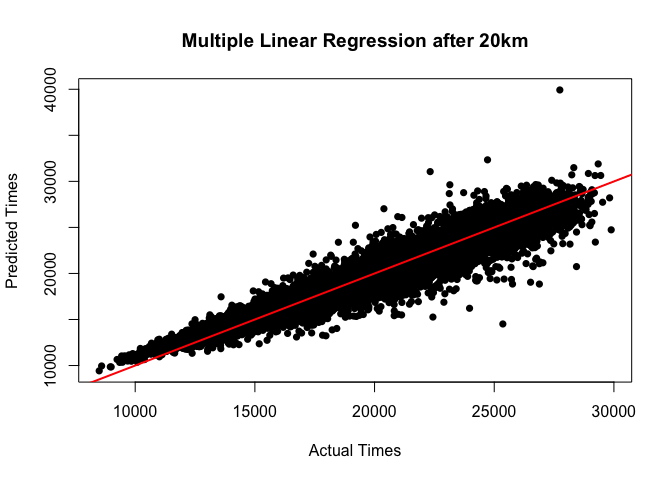

Model Building
================
Peter Chong

``` r
library(glmnet)
```

    ## Warning: package 'glmnet' was built under R version 3.6.2

    ## Loading required package: Matrix

    ## Loaded glmnet 4.0-2

``` r
library(knitr)
```

    ## Warning: package 'knitr' was built under R version 3.6.2

``` r
library(magrittr)
library(caret)
```

    ## Loading required package: lattice

    ## Loading required package: ggplot2

    ## Warning: package 'ggplot2' was built under R version 3.6.2

``` r
#Input files
df <- read.csv("/Users/wengliangchong/Desktop/RunTheData/MarathonData.csv", header = T)
```

## Training Plan

Firstly, we split our dataset into a training set (80% of the runners)
and a test set (20% of the runners). The model is then trained on the
training set and finally evaluated on the test set.

``` r
set.seed(123)
trainRows <- sample(75652, 60522)
train <- df[trainRows,]
test <- df[-trainRows,]
```

At the end, we will have 3 different models.

For our first model, we would like to predict our finishing time before
the race day. Hence, we would use not use variables that are not
available before the race day such as our split times (eg. 5k time).

For our second model, we would include the 5k and 10k split times.
Lastly for our third model, we would include the 15k and 20k split
times.

## Prediction Error

To evaluate the accurary of our predictions, we will compare the
finishing time predictions with the actual finishing times for every
runner in the test set in terms of minutes. For example, if a prediction
for a specific runner was 4:00:00, but the runner actually finished in
4:10:00, the error is 10 minutes. The mean of this error will be
computer as MAE (mean absolute error).

Other than that, we will also change the error into a percentage based
metric. Instead of the absolute number (10m), the error would be 4%. The
mean error will be computed as MAPE (mean absolute percentage error) for
all runners in our test set.

Last but not least, we will also compute R^2 to evaluate the accuracy of
our prediction.

## Model Building

We first build the multiple linear regression as a baseline
model.

## Multiple Linear Regression

``` r
mlrBeforeRaceDay <- lm(X42ks ~ Age+Gender+Temp+Humid+AgeGroup+Bib+Year, data = train)
mlrAfter10k <- lm(X42ks ~ Age+Gender+Temp+Humid+AgeGroup+Bib+Year+X5ks+X10ks, data = train)
mlrAfter20k <- lm(X42ks ~ Age+Gender+Temp+Humid+AgeGroup+Bib+Year+X5ks+X10ks+X15ks+X20ks, data = train)
```

## Ridge Regression

``` r
set.seed(123)
y <- train$X42ks

xBeforeRaceDay <- model.matrix(X42ks~Age+Gender+Temp+Humid+AgeGroup+Bib+Year, train)[,-1]
ridge.cv <- cv.glmnet(xBeforeRaceDay, y, alpha = 0)
ridgeBeforeRaceDay <- glmnet(xBeforeRaceDay, y, alpha = 0, lambda = ridge.cv$lambda.min)

xAfter10k <- model.matrix(X42ks~Age+Gender+Temp+Humid+AgeGroup+Bib+Year+X5ks+X10ks, train)[,-1]
ridge.cv <- cv.glmnet(xAfter10k, y, alpha = 0)
ridgeAfter10k <- glmnet(xAfter10k, y, alpha = 0, lambda = ridge.cv$lambda.min)

xAfter20k <- model.matrix(X42ks~Age+Gender+Temp+Humid+AgeGroup+Bib+Year+X5ks+X10ks+X15ks+X20ks, train)[,-1]
ridge.cv <- cv.glmnet(xAfter20k, y, alpha = 0)
ridgeAfter20k <- glmnet(xAfter20k, y, alpha = 0, lambda = ridge.cv$lambda.min)
```

## Lasso Regression

``` r
set.seed(123)

lasso.cv <- cv.glmnet(xBeforeRaceDay, y, alpha = 1)
lassoBeforeRaceDay <- glmnet(xBeforeRaceDay, y, alpha = 1, lambda = lasso.cv$lambda.min)

lasso.cv <- cv.glmnet(xAfter10k, y, alpha = 1)
lassoAfter10k <- glmnet(xAfter10k, y, alpha = 1, lambda = lasso.cv$lambda.min)

lasso.cv <- cv.glmnet(xAfter20k, y, alpha = 1)
lassoAfter20k <- glmnet(xAfter20k, y, alpha = 1, lambda = lasso.cv$lambda.min)
```

## Results

``` r
#Pre-race models
mlr.rsquarebefore <- round(summary(mlrBeforeRaceDay)$r.squared,3)
mlr.maebefore <- round(mean(abs(test$X42ks - predict(mlrBeforeRaceDay, newdata = test)))/60,3)
mlr.mapebefore <- round(mean(abs((test$X42ks - predict(mlrBeforeRaceDay, newdata = test))/test$X42ks))*100,3)

testxbefore <- model.matrix(X42ks~Age+Gender+Temp+Humid+AgeGroup+Bib+Year, test)[,-1]
prediction <- ridgeBeforeRaceDay %>% predict(testxbefore) %>% as.vector()
ridge.rsquarebefore <- round(R2(prediction, test$X42ks),3)
ridge.maebefore <- round(mean(abs(test$X42ks - predict(ridgeBeforeRaceDay, newx = testxbefore)))/60,3)
ridge.mapebefore <- round(mean(abs((test$X42ks - predict(ridgeBeforeRaceDay, newx = testxbefore))/test$X42ks))*100,3)
  
prediction <- lassoBeforeRaceDay %>% predict(testxbefore) %>% as.vector()
lasso.rsquarebefore <- round(R2(prediction, test$X42ks),3)
lasso.maebefore <- round(mean(abs(test$X42ks - predict(lassoBeforeRaceDay, newx = testxbefore)))/60,3)
lasso.mapebefore <- round(mean(abs((test$X42ks - predict(lassoBeforeRaceDay, newx = testxbefore))/test$X42ks))*100,3)

preRaceResult <- matrix(c("MLR", mlr.rsquarebefore, mlr.maebefore, mlr.mapebefore,
                          "Lasso", lasso.rsquarebefore, lasso.maebefore, lasso.mapebefore,
                          "Ridge", ridge.rsquarebefore, ridge.maebefore, ridge.mapebefore),
                        ncol=4, byrow=TRUE)
kable(preRaceResult, col.names = c("Pre-race", "Rsquared","MAE (mins)","MAPE"), align = "lccc")
```

| Pre-race | Rsquared | MAE (mins) |  MAPE  |
| :------- | :------: | :--------: | :----: |
| MLR      |  0.185   |   49.701   | 16.418 |
| Lasso    |   0.18   |   49.704   | 16.42  |
| Ridge    |   0.18   |   49.757   | 16.45  |

Multiple Linear Regression shows the best model among these three
pre-race models.

``` r
#After 10km models
mlr.rsquare10k <- round(summary(mlrAfter10k)$r.squared,3)
mlr.mae10k <- round(mean(abs(test$X42ks - predict(mlrAfter10k, newdata = test)))/60,3)
mlr.mape10k <- round(mean(abs((test$X42ks - predict(mlrAfter10k, newdata = test))/test$X42ks))*100,3)

testx10k <- model.matrix(X42ks~Age+Gender+Temp+Humid+AgeGroup+Bib+Year+X5ks+X10ks, test)[,-1]
prediction <- ridgeAfter10k %>% predict(testx10k) %>% as.vector()
ridge.rsquare10k <- round(R2(prediction, test$X42ks),3)
ridge.mae10k <- round(mean(abs(test$X42ks - predict(ridgeAfter10k, newx = testx10k)))/60,3)
ridge.mape10k <- round(mean(abs((test$X42ks - predict(ridgeAfter10k, newx = testx10k))/test$X42ks))*100,3)
  
prediction <- lassoAfter10k %>% predict(testx10k) %>% as.vector()
lasso.rsquare10k <- round(R2(prediction, test$X42ks),3)
lasso.mae10k <- round(mean(abs(test$X42ks - predict(lassoAfter10k, newx = testx10k)))/60,3)
lasso.mape10k <- round(mean(abs((test$X42ks - predict(lassoAfter10k, newx = testx10k))/test$X42ks))*100,3)

X10kResult <- matrix(c("MLR", mlr.rsquare10k, mlr.mae10k, mlr.mape10k,
                          "Lasso", lasso.rsquare10k, lasso.mae10k, lasso.mape10k,
                          "Ridge", ridge.rsquare10k, ridge.mae10k, ridge.mape10k),
                        ncol=4,byrow=TRUE)
kable(X10kResult, col.names = c("After 10km", "Rsquared","MAE (mins)","MAPE"), align = "lccc")
```

| After 10km | Rsquared | MAE (mins) | MAPE  |
| :--------- | :------: | :--------: | :---: |
| MLR        |  0.815   |   21.686   | 6.784 |
| Lasso      |  0.818   |   21.722   | 6.797 |
| Ridge      |  0.793   |   23.925   | 7.557 |

Again, Multiple Linear Regression shows the best model among these three
after 10km models.

``` r
#After 20km models
mlr.rsquare20k <- round(summary(mlrAfter20k)$r.squared,3)
mlr.mae20k <- round(mean(abs(test$X42ks - predict(mlrAfter20k, newdata = test)))/60,3)
mlr.mape20k <- round(mean(abs((test$X42ks - predict(mlrAfter20k, newdata = test))/test$X42ks))*100,3)

testx20k <- model.matrix(X42ks~Age+Gender+Temp+Humid+AgeGroup+Bib+Year+X5ks+X10ks+X15ks+X20ks, test)[,-1]
prediction <- ridgeAfter20k %>% predict(testx20k) %>% as.vector()
ridge.rsquare20k <- round(R2(prediction, test$X42ks),3)
ridge.mae20k <- round(mean(abs(test$X42ks - predict(ridgeAfter20k, newx = testx20k)))/60,3)
ridge.mape20k <- round(mean(abs((test$X42ks - predict(ridgeAfter20k, newx = testx20k))/test$X42ks))*100,3)
  
prediction <- lassoAfter20k %>% predict(testx20k) %>% as.vector()
lasso.rsquare20k <- round(R2(prediction, test$X42ks),3)
lasso.mae20k <- round(mean(abs(test$X42ks - predict(lassoAfter20k, newx = testx20k)))/60,3)
lasso.mape20k <- round(mean(abs((test$X42ks - predict(lassoAfter20k, newx = testx20k))/test$X42ks))*100,3)

X20kResult <- matrix(c("MLR", mlr.rsquare20k, mlr.mae20k, mlr.mape20k,
                          "Lasso", lasso.rsquare20k, lasso.mae20k, lasso.mape20k,
                          "Ridge", ridge.rsquare20k, ridge.mae20k, ridge.mape20k),
                        ncol=4,byrow=TRUE)
kable(X20kResult, col.names = c("After 20km", "Rsquared","MAE (mins)","MAPE"), align = "lccc")
```

| After 20km | Rsquared | MAE (mins) | MAPE  |
| :--------- | :------: | :--------: | :---: |
| MLR        |  0.913   |   14.629   | 4.612 |
| Lasso      |  0.915   |   14.654   | 4.622 |
| Ridge      |  0.885   |   17.629   | 5.597 |

And finally Multiple Linear Regression is still the best model for after
20km
models.

## Multiple Linear Models Results

``` r
mlrResult <- matrix(c("Pre-race", mlr.rsquarebefore, mlr.maebefore, mlr.mapebefore, "0%",
                      "After 10km", mlr.rsquare10k, mlr.mae10k, mlr.mape10k, "56.37%",
                      "After 20km", mlr.rsquare20k, mlr.mae20k, mlr.mape20k, "32.54%"),
                    ncol=5, byrow = TRUE)

kable(mlrResult, col.names = c("", "Rsquared","MAE (mins)","MAPE", "Improvement in MAE"), align = "lcccc")
```

|            | Rsquared | MAE (mins) |  MAPE  | Improvement in MAE |
| :--------- | :------: | :--------: | :----: | :----------------: |
| Pre-race   |  0.185   |   49.701   | 16.418 |         0%         |
| After 10km |  0.815   |   21.686   | 6.784  |       56.37%       |
| After 20km |  0.913   |   14.629   | 4.612  |       32.54%       |

Below is a scatter plot of Multiple Linear Regression after 20km of
predicted values against actual values. Most of the points fall closely
on the red line, which is a good
thing.

``` r
plot(test$X42ks, predict(mlrAfter20k, newdata = test), xlab = "Actual Times", ylab = "Predicted Times",
     main = "Multiple Linear Regression after 20km", pch=16)
abline(0,1, col = "red", lwd=2)
```

<!-- -->
