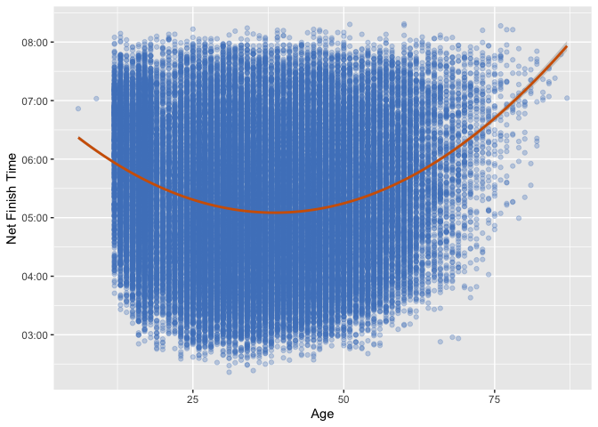

Model Building
================
Peter Chong

``` r
library(ggplot2)
```

``` r
#Input files
df <- read.csv("/Users/wengliangchong/Desktop/RunTheData/MarathonData.csv", header = T, 
               stringsAsFactors = FALSE)
```

``` r
df$AgeGroup <- ifelse(df$Age < 25 , "1 ~ 24", ifelse(df$Age < 35 , "25 ~ 34", ifelse(df$Age < 45 , "35 ~ 44",
                  ifelse(df$Age < 55 , "45 ~ 54", ifelse(df$Age < 65 , "55 ~ 64", "65 ~ 90")))))
```

``` r
time_to_sec <- function(string) {
  time_segments = strsplit(string, split = ":")[[1]]
  if (length(time_segments) == 2) {
    mins = as.numeric(time_segments[1])
    sec = as.numeric(time_segments[2])
    time = mins*60 + sec
  } else {
    hours = as.numeric(time_segments[1])
    mins = as.numeric(time_segments[2])
    sec = as.numeric(time_segments[3])
    time = hours*3600 + mins*60 + sec
  }
  return(time)
}
```

``` r
d5to10k <- c()
d10to15k <- c()
d15to20k <- c()
d20to25k <- c()
d25to30k <- c()
d30to35k <- c()
d35to40k <- c()
d40to42k <- c()
for (i in 1:nrow(df)) {
  first5k <- time_to_sec(df$X5k[i])/5
  second5k <- (time_to_sec(df$X10k[i]) - time_to_sec(df$X5k[i]))/5
  third5k <- (time_to_sec(df$X15k[i]) - time_to_sec(df$X10k[i]))/5
  fourth5k <- (time_to_sec(df$X20k[i]) - time_to_sec(df$X15k[i]))/5
  fifth5k <- (time_to_sec(df$X25k[i]) - time_to_sec(df$X20k[i]))/5
  sixth5k <- (time_to_sec(df$X30k[i]) - time_to_sec(df$X25k[i]))/5
  seventh5k <- (time_to_sec(df$X35k[i]) - time_to_sec(df$X30k[i]))/5
  eighth5k <- (time_to_sec(df$X40k[i]) - time_to_sec(df$X35k[i]))/5
  last2k <- (time_to_sec(df$Net.Time[i]) - time_to_sec(df$X40k[i]))/2.195
  d5to10k[i] <- (second5k - first5k)/first5k*100
  d10to15k[i] <- (third5k - first5k)/first5k*100
  d15to20k[i] <- (fourth5k - first5k)/first5k*100
  d20to25k[i] <- (fifth5k - first5k)/first5k*100
  d25to30k[i] <- (sixth5k - first5k)/first5k*100
  d30to35k[i] <- (seventh5k - first5k)/first5k*100
  d35to40k[i] <- (eighth5k - first5k)/first5k*100
  d40to42k[i] <- (last2k - first5k)/first5k*100
}
df$Hubris10 <- d5to10k
df$Hubris15 <- d10to15k
df$Hubris20 <- d15to20k
df$Hubris25 <- d20to25k
df$Hubris30 <- d25to30k
df$Hubris35 <- d30to35k
df$Hubris40 <- d35to40k
df$Hubris42 <- d40to42k
```

``` r
set.seed(75652)
sample(1:15652,1)
```

    ## [1] 8980

``` r
df[8980, c("Gender", "Year", "AgeGroup")]
```

    ##      Gender Year AgeGroup
    ## 8980   Male 2015  45 ~ 54

``` r
Leg <- c("km 5-10", "km 10-15", "km 15-20", "km 20-25", "km 25-30", "km 30-35", "km 35-40", "km 40-42")
Color <- rep(c("Male", "Year 2015", "Age 45 ~ 54"), each=8)
Diff <- c()
for (i in 1:8) {
  Insert <- (df[8980,20+i]-mean(df[which(df$Gender == "Male"),20+i]))/mean(df[which(df$Gender == "Male"),20+1])
  Diff <- c(Diff, Insert)
}
for (i in 1:8) {
  Insert <- (df[8980,20+i]-mean(df[which(df$Year == 2015),20+i]))/mean(df[which(df$Year == 2015),20+1])
  Diff <- c(Diff, Insert)
}
for (i in 1:8) {
  Insert <- (df[8980,20+i]-mean(df[which(df$AgeGroup == "45 ~ 54"),20+i]))/mean(df[which(df$AgeGroup == "45 ~ 54"),20+1])
  Diff <- c(Diff, Insert)
}
x <- data.frame("Leg" = rep(Leg,3), "Diff" = Diff, "Color" = Color)
```

``` r
ggplot(data=x, aes(x=Leg, y=Diff, fill=Color, color=Color)) + ylab("Runner's Hubris Difference") +
  geom_bar(stat="identity",position=position_dodge(), alpha=0.5) + theme(legend.position = c(0.9, 0.85)) +
  scale_x_discrete(limits=Leg) + scale_y_continuous(limits=c(-4.2,2))
```

<!-- -->

``` r
ggplot(df, aes(Age, as.POSIXct(Net.Time,format="%H:%M:%S"))) +
  geom_point(color = "#4E84C4", alpha=0.3) + ylab("Net Finish Time") + 
  stat_smooth(method = "lm", formula = y ~ poly(x,2), color="#D16103")
```

<!-- -->
